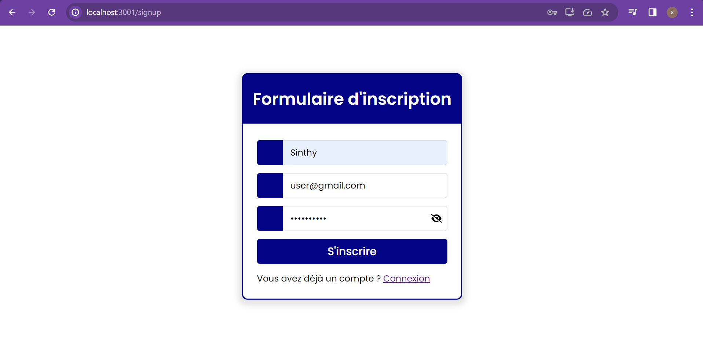

# Documentation du Projet ReactJS - Portfolio

## Introduction

Ce projet est un site de portfolio développé en utilisant ReactJS. Il propose une structure organisée avec des fonctionnalités telles que la gestion des utilisateurs (connexion et inscription) via Supabase, ainsi qu'une intégration d'API pour afficher des articles sur la page d'accueil.

## Structure du Projet

La structure du projet est organisée de manière logique pour faciliter la maintenance et la compréhension. Voici un aperçu des principaux répertoires et fichiers :

- **`src/` :** Contient le code source du projet.
  - **`pages/` :** Comprend les composants de chaque page.
  - Homepage.jsx
  - Login.jsx
  - SignUp.jsx
  - index.js
  - **`styles/` :** Contient les fichiers de styles CSS.
  - Article.css
  - formulaire.css
  - **`client.js` :** Fichier de configuration pour la connexion à Supabase.
  - **`index.js` :** Point d'entrée de l'application.
  - **`Article.js` :** Composant pour la gestion des articles.
  - **`App.js` (ou `App.jsx`):** Fichier principal définissant les routes et gérant l'état global.
  - **`setupTests.js` :** Configuration pour les tests Jest.

__Chaque fichier est commenté.__

## Gestion des Utilisateurs avec Supabase

Les pages de connexion et d'inscription utilisent Supabase pour gérer l'authentification. Les données des utilisateurs sont stockées dans une base de données Supabase. Le composant `client.js` configure la connexion à Supabase.

La mise en place de la gestion des utilisateurs avec Supabase pour les fonctionnalités de connexion et d'inscription a été réalisée en suivant les tutoriels YouTube de "CodeWithThilakS | CWTS" disponibles dans la playlist suivante : [Supabase Login and Sign Up Tutorial Playlist](https://www.youtube.com/playlist?list=PLl6EcvA_AoxEU455Yi1JoYV
 

 

### Connexion (`Login.jsx`) et Inscription (`SignUp.jsx`)

Le design des pages de connexion (Login.jsx) et d'inscription (SignUp.jsx) a été inspiré par une template HTML et CSS disponible sur CodingNepalWeb. Voici le lien :  https://www.codingnepalweb.com/responsive-login-form-using-only-html-css/

- **`Login.jsx` :** Permet à l'utilisateur de se connecter à son compte existant.
 

 
- **`SignUp.jsx` :** Permet à l'utilisateur de créer un nouveau compte. Un e-mail de confirmation est envoyé à l'utilisateur depuis "noreply@mail.app.supabase.io".
 

 

 

L'utilisation de Font Awesome a été intégrée pour améliorer l'expérience utilisateur, notamment avec les icônes d'œil permettant de montrer et masquer les mots de passe sur les pages de connexion et d'inscription.

### Stockage du Token

Le token d'authentification est stocké dans la session via `sessionStorage`. Si un utilisateur est déjà connecté (le token est présent dans `sessionStorage`), il est automatiquement redirigé vers la page d'accueil.

## Déconnexion

La page d'accueil (`Homepage.jsx`) contient un bouton "Logout" qui permet à l'utilisateur de se déconnecter. En cliquant sur ce bouton, l'utilisateur est redirigé vers la page de connexion (`Login.jsx`).
 

 

## Intégration d'API pour les Articles

La page d'accueil (`Homepage.jsx`) intègre des articles à partir de l'API JSONPlaceholder. Le composant `Article.js` effectue une requête Axios pour récupérer les articles et les affiche de manière structurée.

- **`Article.js` :** Composant pour la gestion et l'affichage des articles.
- **`styles/Article.css` :** Styles spécifiques pour la mise en page des articles.
 

 
